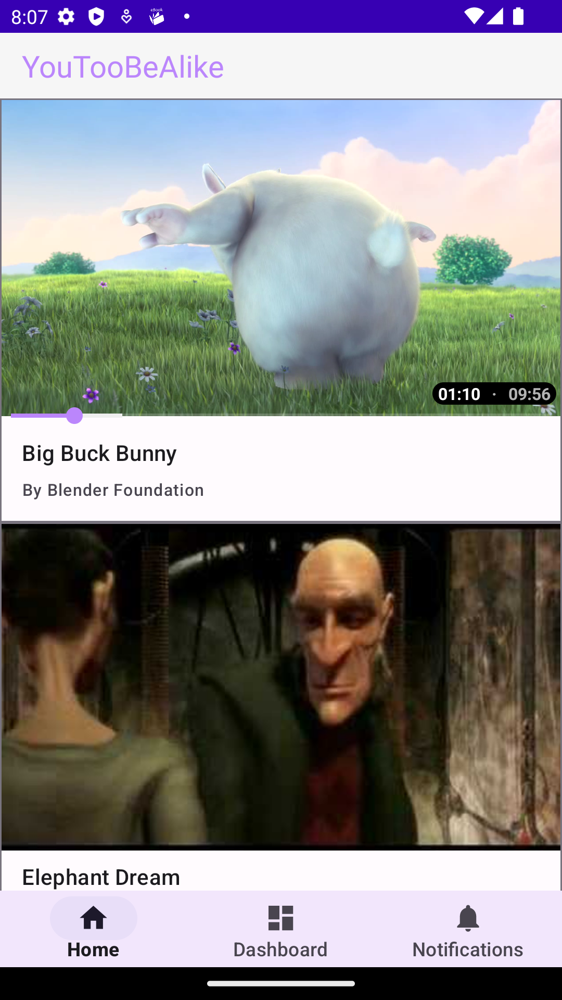
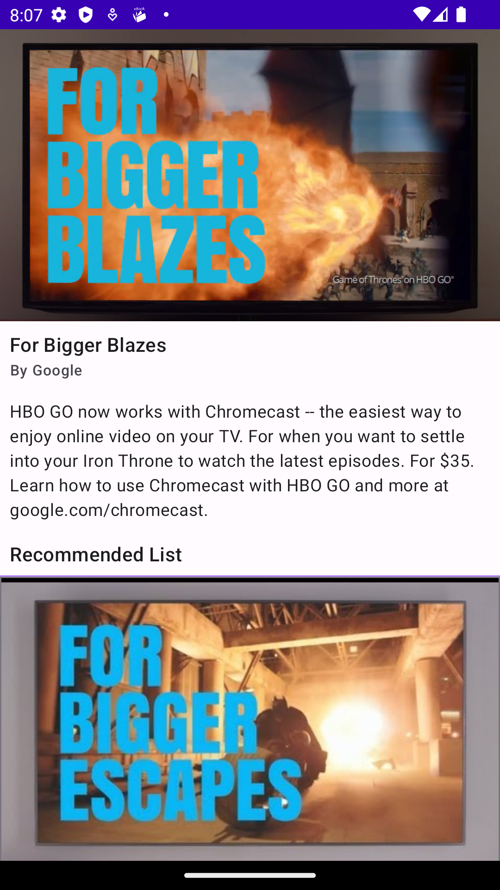
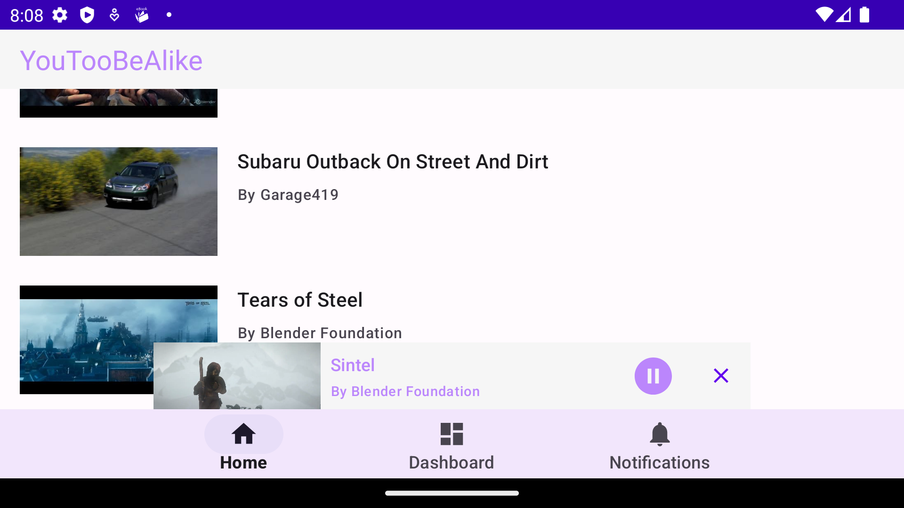
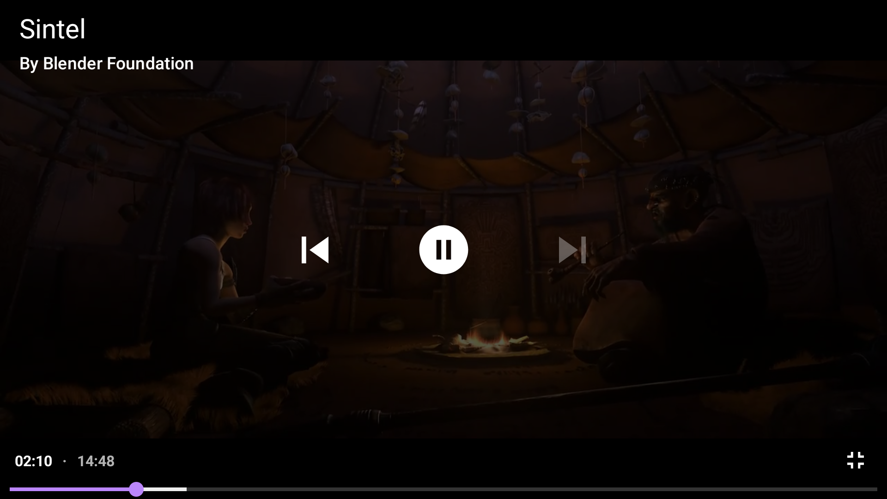

# YouTooBeAlike
Android application architecture sample. This project demonstrates how to achieve a YouTube-like UX and how to handle media playbacks in this case.
# Goal
Create a code structure which has the benefits described in [Guide to app architecture](https://developer.android.com/topic/architecture) and [Guide to Android app modularization](https://developer.android.com/topic/modularization).
# Screenshots
 &emsp; 
 &emsp;
 &emsp;
 &emsp;

# License
```
Copyright 2022 Deathhit

Licensed under the Apache License, Version 2.0 (the "License");
you may not use this file except in compliance with the License.
You may obtain a copy of the License at

    http://www.apache.org/licenses/LICENSE-2.0

Unless required by applicable law or agreed to in writing, software
distributed under the License is distributed on an "AS IS" BASIS,
WITHOUT WARRANTIES OR CONDITIONS OF ANY KIND, either express or implied.
See the License for the specific language governing permissions and
limitations under the License.
```
